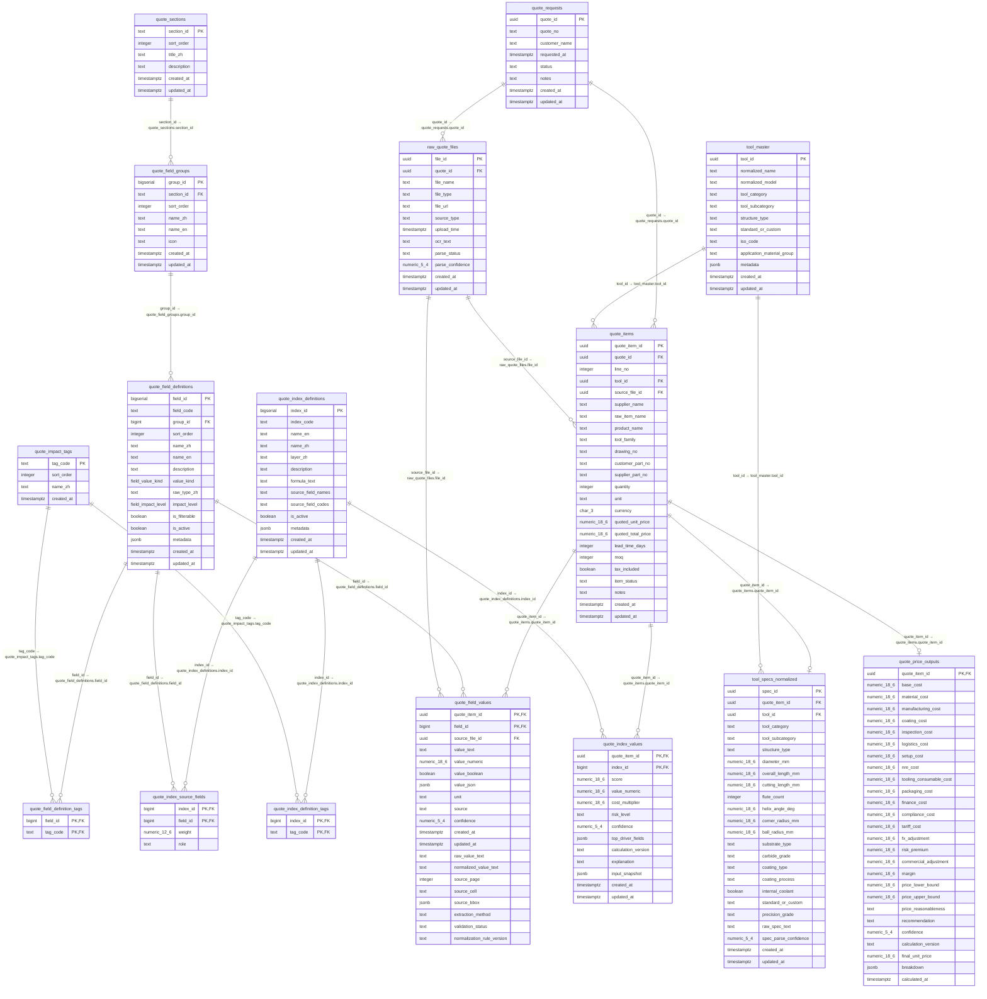
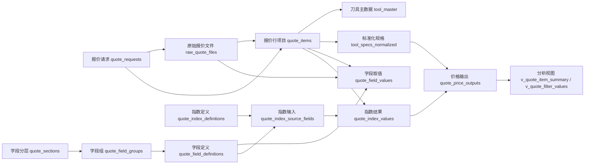

# BladeWise刀具报价 Schema 图源文件

## ER 图（Mermaid 源码，可粘贴到支持 Mermaid 的 Markdown / draw.io 中）

```mermaid
erDiagram
  quote_sections ||--o{ quote_field_groups : "section_id → quote_sections.section_id"
  quote_field_groups ||--o{ quote_field_definitions : "group_id → quote_field_groups.group_id"
  quote_field_definitions ||--o{ quote_field_definition_tags : "field_id → quote_field_definitions.field_id"
  quote_impact_tags ||--o{ quote_field_definition_tags : "tag_code → quote_impact_tags.tag_code"
  quote_index_definitions ||--o{ quote_index_definition_tags : "index_id → quote_index_definitions.index_id"
  quote_impact_tags ||--o{ quote_index_definition_tags : "tag_code → quote_impact_tags.tag_code"
  quote_index_definitions ||--o{ quote_index_source_fields : "index_id → quote_index_definitions.index_id"
  quote_field_definitions ||--o{ quote_index_source_fields : "field_id → quote_field_definitions.field_id"
  quote_requests ||--o{ raw_quote_files : "quote_id → quote_requests.quote_id"
  quote_requests ||--o{ quote_items : "quote_id → quote_requests.quote_id"
  tool_master ||--o{ quote_items : "tool_id → tool_master.tool_id"
  raw_quote_files ||--o{ quote_items : "source_file_id → raw_quote_files.file_id"
  quote_items ||--o| tool_specs_normalized : "quote_item_id → quote_items.quote_item_id"
  tool_master ||--o{ tool_specs_normalized : "tool_id → tool_master.tool_id"
  quote_items ||--o{ quote_field_values : "quote_item_id → quote_items.quote_item_id"
  quote_field_definitions ||--o{ quote_field_values : "field_id → quote_field_definitions.field_id"
  raw_quote_files ||--o{ quote_field_values : "source_file_id → raw_quote_files.file_id"
  quote_items ||--o{ quote_index_values : "quote_item_id → quote_items.quote_item_id"
  quote_index_definitions ||--o{ quote_index_values : "index_id → quote_index_definitions.index_id"
  quote_items ||--o| quote_price_outputs : "quote_item_id → quote_items.quote_item_id"

  quote_sections {
    text section_id "PK"
    integer sort_order
    text title_zh
    text description
    timestamptz created_at
    timestamptz updated_at
  }
  quote_field_groups {
    bigserial group_id "PK"
    text section_id "FK"
    integer sort_order
    text name_zh
    text name_en
    text icon
    timestamptz created_at
    timestamptz updated_at
  }
  quote_impact_tags {
    text tag_code "PK"
    integer sort_order
    text name_zh
    timestamptz created_at
  }
  quote_field_definitions {
    bigserial field_id "PK"
    text field_code
    bigint group_id "FK"
    integer sort_order
    text name_zh
    text name_en
    text description
    field_value_kind value_kind
    text raw_type_zh
    field_impact_level impact_level
    boolean is_filterable
    boolean is_active
    jsonb metadata
    timestamptz created_at
    timestamptz updated_at
  }
  quote_field_definition_tags {
    bigint field_id "PK,FK"
    text tag_code "PK,FK"
  }
  quote_index_definitions {
    bigserial index_id "PK"
    text index_code
    text name_en
    text name_zh
    text layer_zh
    text description
    text formula_text
    text source_field_names
    text source_field_codes
    boolean is_active
    jsonb metadata
    timestamptz created_at
    timestamptz updated_at
  }
  quote_index_definition_tags {
    bigint index_id "PK,FK"
    text tag_code "PK,FK"
  }
  quote_index_source_fields {
    bigint index_id "PK,FK"
    bigint field_id "PK,FK"
    numeric_12_6 weight
    text role
  }
  quote_requests {
    uuid quote_id "PK"
    text quote_no
    text customer_name
    timestamptz requested_at
    text status
    text notes
    timestamptz created_at
    timestamptz updated_at
  }
  raw_quote_files {
    uuid file_id "PK"
    uuid quote_id "FK"
    text file_name
    text file_type
    text file_url
    text source_type
    timestamptz upload_time
    text ocr_text
    text parse_status
    numeric_5_4 parse_confidence
    timestamptz created_at
    timestamptz updated_at
  }
  tool_master {
    uuid tool_id "PK"
    text normalized_name
    text normalized_model
    text tool_category
    text tool_subcategory
    text structure_type
    text standard_or_custom
    text iso_code
    text application_material_group
    jsonb metadata
    timestamptz created_at
    timestamptz updated_at
  }
  quote_items {
    uuid quote_item_id "PK"
    uuid quote_id "FK"
    integer line_no
    uuid tool_id "FK"
    uuid source_file_id "FK"
    text supplier_name
    text raw_item_name
    text product_name
    text tool_family
    text drawing_no
    text customer_part_no
    text supplier_part_no
    integer quantity
    text unit
    char_3 currency
    numeric_18_6 quoted_unit_price
    numeric_18_6 quoted_total_price
    integer lead_time_days
    integer moq
    boolean tax_included
    text item_status
    text notes
    timestamptz created_at
    timestamptz updated_at
  }
  tool_specs_normalized {
    uuid spec_id "PK"
    uuid quote_item_id "FK"
    uuid tool_id "FK"
    text tool_category
    text tool_subcategory
    text structure_type
    numeric_18_6 diameter_mm
    numeric_18_6 overall_length_mm
    numeric_18_6 cutting_length_mm
    integer flute_count
    numeric_18_6 helix_angle_deg
    numeric_18_6 corner_radius_mm
    numeric_18_6 ball_radius_mm
    text substrate_type
    text carbide_grade
    text coating_type
    text coating_process
    boolean internal_coolant
    text standard_or_custom
    text precision_grade
    text raw_spec_text
    numeric_5_4 spec_parse_confidence
    timestamptz created_at
    timestamptz updated_at
  }
  quote_field_values {
    uuid quote_item_id "PK,FK"
    bigint field_id "PK,FK"
    uuid source_file_id "FK"
    text value_text
    numeric_18_6 value_numeric
    boolean value_boolean
    jsonb value_json
    text unit
    text source
    numeric_5_4 confidence
    timestamptz created_at
    timestamptz updated_at
    text raw_value_text
    text normalized_value_text
    integer source_page
    text source_cell
    jsonb source_bbox
    text extraction_method
    text validation_status
    text normalization_rule_version
  }
  quote_index_values {
    uuid quote_item_id "PK,FK"
    bigint index_id "PK,FK"
    numeric_18_6 score
    numeric_18_6 value_numeric
    numeric_18_6 cost_multiplier
    text risk_level
    numeric_5_4 confidence
    jsonb top_driver_fields
    text calculation_version
    text explanation
    jsonb input_snapshot
    timestamptz created_at
    timestamptz updated_at
  }
  quote_price_outputs {
    uuid quote_item_id "PK,FK"
    numeric_18_6 base_cost
    numeric_18_6 material_cost
    numeric_18_6 manufacturing_cost
    numeric_18_6 coating_cost
    numeric_18_6 inspection_cost
    numeric_18_6 logistics_cost
    numeric_18_6 setup_cost
    numeric_18_6 nre_cost
    numeric_18_6 tooling_consumable_cost
    numeric_18_6 packaging_cost
    numeric_18_6 finance_cost
    numeric_18_6 compliance_cost
    numeric_18_6 tariff_cost
    numeric_18_6 fx_adjustment
    numeric_18_6 risk_premium
    numeric_18_6 commercial_adjustment
    numeric_18_6 margin
    numeric_18_6 price_lower_bound
    numeric_18_6 price_upper_bound
    text price_reasonableness
    text recommendation
    numeric_5_4 confidence
    text calculation_version
    numeric_18_6 final_unit_price
    jsonb breakdown
    timestamptz calculated_at
  }
```

## 逻辑图（Mermaid 源码）

```mermaid
flowchart LR
  A[报价请求 quote_requests] --> B[原始报价文件 raw_quote_files]
  A --> C[报价行项目 quote_items]
  B --> C
  C --> D[刀具主数据 tool_master]
  C --> E[标准化规格 tool_specs_normalized]
  F[字段分层 quote_sections] --> G[字段组 quote_field_groups] --> H[字段定义 quote_field_definitions]
  H --> I[字段取值 quote_field_values]
  C --> I
  B --> I
  H --> J[指数输入 quote_index_source_fields]
  K[指数定义 quote_index_definitions] --> J
  J --> L[指数结果 quote_index_values]
  C --> L
  E --> M[价格输出 quote_price_outputs]
  L --> M
  M --> N[分析视图 v_quote_item_summary / v_quote_filter_values]
```
